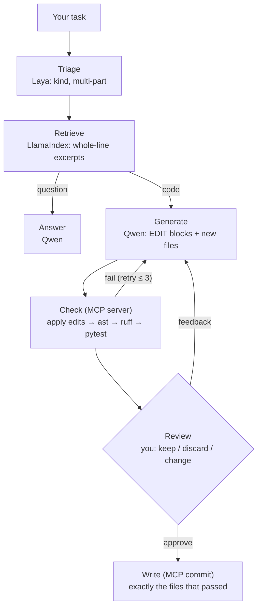
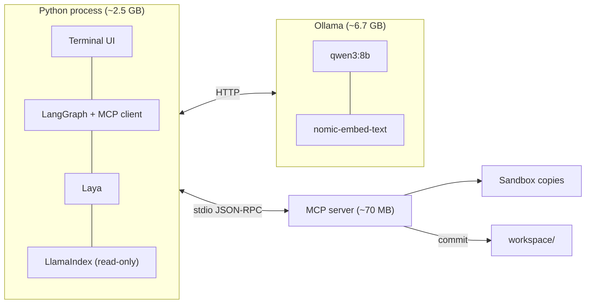

# Local Software Factory

A fully local AI coding assistant sized for a **CPU-only laptop** (built and tested on a Ryzen 7 4700U with 16 GB RAM and no GPU).
You describe a program. **Laya** decides what kind of task it is, **LangGraph** runs the workflow,
**Qwen 3 8B** (via Ollama) writes the code, an **MCP server** tests it in a sandbox, and
**nothing is saved until you approve the diff**.

It comes with four front ends:

| Command | For | What it does |
|---|---|---|
| `python factory_cli.py` | developers | One task at a time, Claude Code-style terminal UI |
| `python dev_cli.py` | developers | **Design → build**: writes a system design, then builds it step by step |
| `python kid_cli.py` / `Robo.exe` | kids | "Robo": plain words, single-key buttons, a *Try it!* button |
| `python cli.py` / `python app.py` | anyone | Simple RAG chat over your documents (terminal or Gradio web UI) |

Everything runs on your machine. No cloud APIs and no API keys.

---

## How it works



| Layer | Component | Role |
|---|---|---|
| Triage | [Laya](https://github.com/NandhaKishorM/laya) (421M ModernBERT, non-autoregressive) | Classifies each request (new code / bug fix / question) and whether it's multi-part, which decides whether Qwen's slow reasoning mode is used. ~1 s on CPU. |
| Orchestration | LangGraph | The state machine above: retry loop with a hard limit, `interrupt()` for human review, a checkpointer so the graph can pause. |
| Retrieval | LlamaIndex + `CodeSplitter` | Indexes the workspace by function/class. Files you name in the request come first; big files arrive as excerpts widened to whole lines. |
| Generation | Qwen 3 8B via Ollama | Writes `SEARCH/REPLACE` edit blocks for existing files and whole files only for new ones. Streams tokens to the UI. |
| Guardrails | `mcp_server.py` (MCP over stdio) | The **only** component that writes to the workspace or runs code. Applies edits in a throwaway sandbox copy, runs ast → placeholder scan → ruff → pytest, and commits the exact files that passed. |



### Why edit blocks instead of whole files

On this CPU Qwen writes about 4 tokens/second, so rewriting a 345-line file (~3,500 tokens) takes around 15 minutes
per attempt. A two-line fix as an edit block is ~160 tokens (about a minute). The matcher that applies edits
tries passes from strictest to most tolerant (exact → trailing whitespace → blank lines → uniform indentation shift),
but **every pass must match exactly one place**. Zero or several matches reject the edit, and Qwen is sent the
closest real text to try again.

---

## Requirements

- **Windows 10/11** (the launcher and single-key input are Windows-specific; the rest is plain Python but only tested on Windows)
- **Python 3.10+** (tested on 3.13)
- **[Ollama](https://ollama.com)**
- **16 GB RAM.** About 9.5 GB is in use while it runs; close browsers and other heavy apps first.

## Setup

```bash
git clone https://github.com/champion19007/local-software-factory.git
cd local-software-factory

# CPU-only PyTorch first (much smaller than the default GPU build), then everything else
pip install torch --index-url https://download.pytorch.org/whl/cpu
pip install -r requirements.txt

# The models Ollama serves
ollama pull qwen3:8b
ollama pull nomic-embed-text
```

The first start downloads Laya (~800 MB) into `models/`, pinned to a tested revision.

Check the install (no Ollama needed):

```bash
python -m pytest tests
```

---

## Usage

### `factory_cli.py`: one task at a time

```bash
python factory_cli.py
```

Type a task, e.g. `add a --verbose flag to cli.py`. You'll see each stage: triage, retrieved files, Qwen writing,
check results. At the end you get a diff to approve with `y`, reject with `n`, or answer with feedback to revise.
Commands: `/files`, `/reindex`, `/help`, `/exit`.

To work on an existing project instead of `./workspace`:

```bash
set WORKSPACE=C:\path\to\your\project
python factory_cli.py
```

### `dev_cli.py`: design first, then build

```bash
python dev_cli.py
```

```
> /design a todo list app that saves to JSON, with a text menu
   Qwen writes: goal, components, file layout, data flow, a Mermaid diagram, 3–7 build steps
   accept · discard · or type feedback to revise: a
> /build all     each step runs through the factory; you approve each one
> /plan          ✓ done   ▶ next   · pending
```

| Command | |
|---|---|
| `/design <idea>` | Generate a system design (saved to `designs/<name>.md`) |
| `/build` · `/build all` · `/build <n>` | Build the next step, every remaining step, or step *n* |
| `/plan` | Steps and their status |
| `/skip <n>` | Mark a step done after fixing it by hand |
| `/designs` · `/open <n>` | List saved designs / switch to one (progress is remembered) |
| `/think on\|off\|auto` | Reasoning for design generation (auto = Laya decides) |
| anything else | A normal one-off factory task |

A step only counts as done if its checks pass, and `/build all` stops at the first step that doesn't.
Expect **5–10 minutes per step** on a laptop CPU.

### Robo: for kids

```bash
python kid_cli.py
```

Or build a desktop launcher (Windows):

```bash
python build_robo_exe.py
```

This compiles a ~27 KB `Robo.exe` with the C# compiler that ships with Windows and copies it to your Desktop.
Double-clicking it starts Ollama if it isn't running, stops a second copy from opening, and opens Robo.

Robo talks in plain words, shows a robot face while it works, and uses single-key buttons:
**Y** keep · **N** throw away · **T** tell me what to change · **S** show the code · **P** try it.
Code that failed its checks **can't be kept** from Robo's screen, and nothing is saved without **Y**.

> **Grown-ups:** *Try it* (**P**) runs the program Robo made directly on this computer, not in the sandbox.
> It has passed its tests, but tests don't prove code is harmless. Be nearby.

If you move the project folder or change Python installs, run `python build_robo_exe.py` again.

### Document chat (RAG)

```bash
python cli.py     # terminal
python app.py     # web UI at http://127.0.0.1:7860
```

Put PDF, `.md` or `.txt` files in `data/`. Questions whose best document match scores ≥ 0.55 are answered from
your documents, with sources; everything else goes straight to the model.

---

## Configuration

All optional, set as environment variables:

| Variable | Default | |
|---|---|---|
| `WORKSPACE` | `workspace` | Folder the factory reads and writes |
| `LLM_MODEL` | `qwen3:8b` | Ollama model for code and answers |
| `EMBED_MODEL` | `nomic-embed-text` | Ollama embedding model |
| `OLLAMA_HOST` | `http://localhost:11434` | |
| `NUM_THREAD` | physical cores | Ollama picked 4 of 8 on the test laptop; using all 8 was 25–43% faster |
| `NUM_CTX` | `8192` | Context window; lower it to save RAM (~0.6 GB at 4096) |
| `KEEP_ALIVE` | `30m` | How long Qwen stays loaded between tasks |
| `LAYA_REVISION` | pinned commit | Laya model revision (upstream changed 3 times in 2 days during development) |
| `RAG_SCORE_THRESHOLD` | `0.55` | Document-chat routing threshold |
| `DATA_DIR` / `PERSIST_DIR` | `data` / `storage` | Document chat folders |

---

## Performance (Ryzen 7 4700U, 16 GB, plugged in)

| | Measured |
|---|---|
| Qwen generation | ~3.5–4 tokens/s |
| Prompt reading | ~20–30 tokens/s (a retry reuses Ollama's cache: 50 s → 5 s) |
| Laya triage | ~1 s per request (after a ~50 s first load) |
| Small fix to a 345-line file | 1 edit, ~160 tokens, ~1 min of generation |
| 5-step designed program (`dev_cli`) | ~40 min including retries |

Things that made the biggest difference, all measured:

- **Plug the laptop in.** On battery the same prompt ran up to 2× slower.
- **Close the browser.** Swapping to disk dropped generation to 0.6 tokens/s.
- **The integrated Radeon GPU (Vulkan) gave no speedup.** Generation is limited by memory bandwidth, which the iGPU shares with the CPU.
- **8-bit Laya was faster but changed 5 of 8 triage decisions**, so Laya stays full precision.

---

## Safety

- **The MCP server is the only writer.** Every change is tested in a sandbox copy, and `commit` copies exactly the files that passed. Paths outside the workspace are rejected.
- **Nothing is written without your approval.**
- **The sandbox is not a security boundary.** Tests run as your Windows user, with a 60 s timeout; they could reach the network or your files. Review what you approve.

## Troubleshooting

| Symptom | Fix |
|---|---|
| "is Ollama running?" / Robo: "My brain isn't answering" | Start the Ollama app, or run `ollama serve` |
| Very slow (< 2 tokens/s) | Plug in, close the browser, check Task Manager for memory pressure |
| An edit keeps failing | See `logs/factory.log`: every prompt, raw Qwen reply and check result is recorded there |
| "the MCP server stopped" | It restarts automatically on the next task |
| Robo.exe: "I can't find my files" | Run `python build_robo_exe.py` again |

## Project layout

```
factory.py          LangGraph pipeline: triage, retrieval, generation, checks, review, write
mcp_server.py       MCP server: sandbox, edit matcher, ast/ruff/pytest, commit
mcp_client.py       Synchronous MCP client for the graph (reconnects if the server dies)
factory_cli.py      Developer terminal UI
dev_cli.py          Design → build console
kid_cli.py          Robo, the kid-friendly UI
app.py / cli.py     Document chat: Gradio web UI / terminal
build_robo_exe.py   Builds the Robo.exe desktop launcher
launcher/           C# launcher template
tests/              Offline tests (no Ollama needed)
```

## Known limitations

- **Slow.** It's an 8B model on a laptop CPU; multi-step programs take tens of minutes.
- **Qwen 8B makes mistakes that tests don't catch**, such as an unrelated edit. Read the diff before approving.
- **Qwen often forgets the test file on its first try,** which costs a retry. The prompt reminds it, but not always successfully.
- **Once during testing a build froze inside the check step.** A likely cause was fixed (tests could inherit the MCP connection's input), but it wasn't reproduced, so that's unconfirmed.

## Credits

[Qwen 3](https://github.com/QwenLM/Qwen3) (Alibaba), [Laya](https://github.com/NandhaKishorM/laya) (Convai Innovations),
[LangGraph](https://github.com/langchain-ai/langgraph), [LlamaIndex](https://github.com/run-llama/llama_index),
[Ollama](https://ollama.com), [MCP Python SDK](https://github.com/modelcontextprotocol/python-sdk),
[Rich](https://github.com/Textualize/rich) and [Gradio](https://gradio.app).
Model weights are downloaded from their publishers and are not included in this repository.
